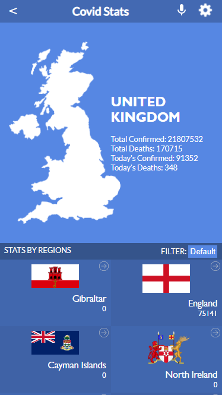

# Covid Metrics WebApp

>  This project is for get covid metrics on the United Kingdom using a SPA (Single Page App), and getting the data from [Narrative API](https://covid19tracking.narrativa.com/index_en.html)

## Getting Started

Clone the repository and install the dependencies

## Prerequisites

- npm ( Node Package Manager )
- git and Github Account

### Setup

To get a local copy up and running follow these simple example steps.

- Open terminal
- Change the directory you want put the repo
- Then run
  
   1. Run `git clone git@github.com:ryxtor/covid-metrics-webapp.git`
   2. Go to the project folder `cd covid-metrics-webapp/`
   3. Install npm dependencies `npm install`
   4. Start the webpage on development mode `npm start`
## Built With

- HTML
- CSS
- JavaScript
- Linters
- React
- Redux

## Live Demo

[Live Demo Link](https://covid-tracker-ryxtor.netlify.app/)
## Author

👤 **Lucas Bonnefon**

- GitHub: [@ryxtor](https://github.com/ryxtor)
- Twitter: [@ryxtor](https://twitter.com/ryxtor)
- LinkedIn: [Lucas Bonnefon](https://www.linkedin.com/in/lucasbonnefon/)

## 🤝 Contributing

Contributions, issues, and feature requests are welcome!

Feel free to check the [issues page](https://github.com/ryxtor/covid-metrics-webapp/issues).

## Show your support

Give a ⭐️ if you like this project!

## Acknowledgments

- Original design idea by [Nelson Sakwa on Behance.](https://www.behance.net/sakwadesignstudio)

## 📝 License

This project is [MIT](./MIT.md) and [Creative Commons](https://creativecommons.org/licenses/by-nc/4.0/) licensed.